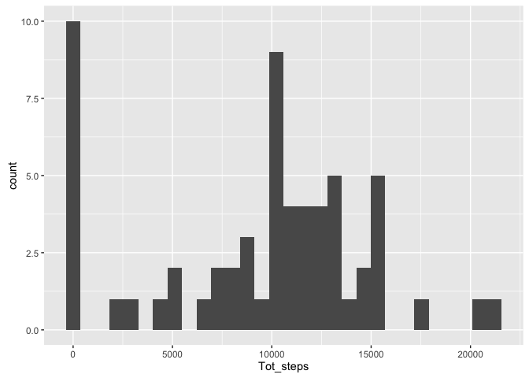

# Reproducible Research: Peer Assessment 1


## Loading and preprocessing the data
The following code loads all the necessary libraries unzips and loads the data.
After loading the data the **date** variable is converted to date-type.


```r
options(scipen=999) # Removes scientific notation in printed variables. Useful for later.
library(dplyr)
library(ggplot2)
activity <- read.csv(unz("activity.zip", "activity.csv"), stringsAsFactors = F)
activity$date <- as.Date(activity$date)
```

## What is mean total number of steps taken per day?
The first step is to create a dataset with the aggregation of 
all the steps within a day. In order to do this I used the *group_by* function
from the package *dplyr*. After the plot of total number of steps per day in function
of the date is produced using *ggplot*.


```r
g1 <- activity %>% group_by(date) %>% summarise(Tot_steps = sum(steps, na.rm = T))
ggplot(data = g1, aes(Tot_steps)) + geom_histogram()
```



Calculate mean and median total number of steps per day:

```r
mean_withna <- round(mean(g1$Tot_steps),0)
median_withna <- median(g1$Tot_steps)
```
The mean and median total steps per day are respectively: 9354 and 10395.

## What is the average daily activity pattern?
The average number of steps per interval is calculated similarly to what done in the previous step. The plot of average number of steps vs interval is again produced using *ggplot*. Following the code:


```r
g_mean_int <- activity %>% group_by(interval) %>% summarise(meanstep = mean(steps, na.rm = T))
ggplot(g_mean_int, aes(interval, meanstep)) + geom_line() +ylab("Average number of steps")
```


On average the interval with the biggest amount of steps is:


```r
with(g_mean_int, interval[which(meanstep == max(meanstep))]) 
```

```
## [1] 835
```

## Imputing missing values
The total amount of missing values is:


```r
print(paste0("Total missing values = ", sum(is.na(activity$steps))))
```

```
## [1] "Total missing values = 2304"
```

In order to fill the missing values, I decided to use the average number of steps per interval over the entire duration available in the data set. This has been calculated in the previous
section and a dataset containing avarage steps per interval is already available (**g_mean_int**).  
The following code creates a new dataset, **activity_nafill**, by merging the original dataset with **g_mean_int** on interval. The new dataset will contain an extra variable called **meanstep**. This variable represents the average number of steps for each particular interval.
After that it is only a matter of substituting the *NULL* values with the averages.
The new dataset is also reordered by date and the **meanstep** variable is eliminated because 
it is of no use now. The last two operations are done to have a dataset which resembles the original.


```r
activity_nafill <- merge(activity, g_mean_int, by.x = "interval", by.y = "interval", all.x = T)
activity_nafill$steps[is.na(activity_nafill$steps)] <- with(activity_nafill,
                                                            round(meanstep[is.na(steps)],0))
# Tidying up the dataset
activity_nafill <- activity_nafill[order(activity_nafill$date),c("steps", "date", "interval")]
rownames(activity_nafill) <- 1:nrow(activity_nafill) #reorder row names

# Print first rows to show the structure of the new dataset
head(activity_nafill)
```

```
##   steps       date interval
## 1     2 2012-10-01        0
## 2     0 2012-10-01        5
## 3     0 2012-10-01       10
## 4     0 2012-10-01       15
## 5     0 2012-10-01       20
## 6     2 2012-10-01       25
```

Plot a histogram of the total number of steps taken each day.


```r
g <- activity_nafill %>% group_by(date) %>% summarise(Tot_steps = sum(steps, na.rm = T))
ggplot(data = g, aes(Tot_steps)) + geom_histogram()
```


Calculate new mean and median total daily steps are:

```r
mean_withoutna <- round(mean(g$Tot_steps),0)
median_withoutna <- round(median(g$Tot_steps),0)
```
The new mean and median are respectively 10766 and 10762. Comparing
them with the original ones 9354 and 10395, the impact of filling *NA* can be clearly seen.

## Are there differences in activity patterns between weekdays and weekends?
Create a new factor variable in the original dataset to distinguish weekdays from weekends:


```r
weekend <- c("Saturday", "Sunday")
activity$weekpart <- ifelse(weekdays(activity$date) %in% weekend, "weekend", "weekday") %>%
        as.factor()
```

Plot the average number of steps per interval, distinguishing weekend and weekday:


```r
g_mean_int_week <- activity %>% 
              group_by(interval, weekpart) %>% 
              summarise(meanstep = mean(steps, na.rm = T))

ggplot(g_mean_int_week, aes(x = interval, y = meanstep, colour = weekpart)) + geom_line() +
        facet_grid(weekpart ~ .) + ylab("Average number of steps")
```


As it can be noticed there are differences between the weekday and weekend patterns.
